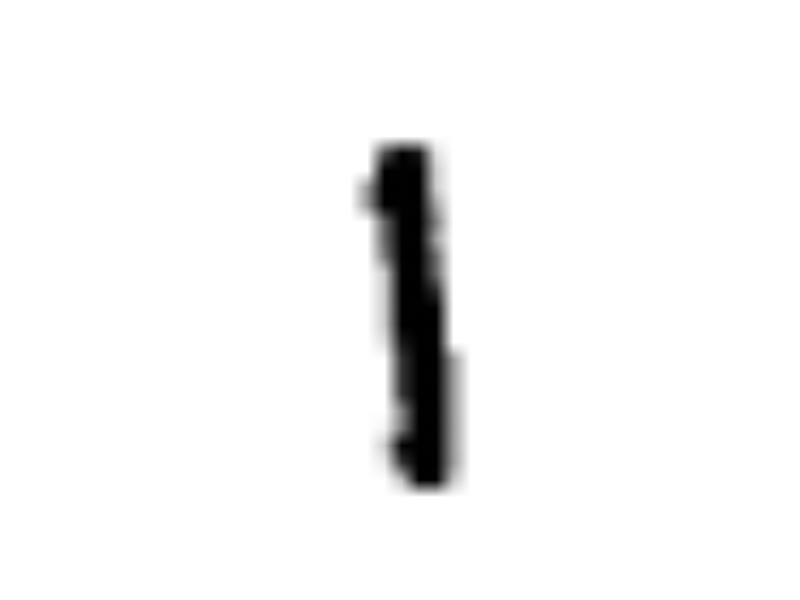
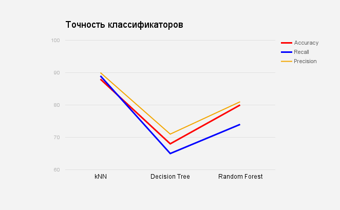

# Семестровая работа по дисциплене  
# "Машинное обучение"

# Тема : "_Распознование цифр_"

### Выполнил
Плискин Александр Маркович  
Высшая школа ИТИС  
группа 11-401

### Руководитель
Новиков Пётр Андреевич

________________________________________

#1.Описание набора данных

## Digits recognizer for MNIST data

1. Была выбрана задача https://www.kaggle.com/c/digit-recognizer.  
Используя MNIST данные нужно будет распознать и классифицировать фотографии цифр.

2. Данные представляют собой двумерный массив. Каждое изображение представляет из себя матрицу 28х28 пикселей.
Значениями ячеек(значение каждого пикселя) явлются числа от 0 до 255, которые обозначают "темноту" пикселя(0 - белый или пустой, 255 - абсолютно черный)
Обучающий набор состоит из 42000 цифр. Если быть точнее то обучающим набором является матрица 42000х785
в первом столбце стоит **label** - изображенная цифра, остальное - значения пикселей
Данными для распознования является матрица размером 28000х784. В ней уже 28000 цифр, и отсутсвует столбец, обозначающий label(изображенную цифру)

________________________________________

#2.Преобразования с данными

## Data processing

 Для считывания данных из csv-файла использовалась библиотека pandas.
 При помощи метода **read_csv('<file_name>.csv')** данные из csv-файла преобразовывались в массив и передавались в значение переменной.

 Данные представлены в виде матрицы из 42000 тысяч экземплров чисел.
 Каждый экземпляр состоит из 785 ячеек.
 При помощи пакета управления массивами numpy каждый такой экземпляр преобразовывался в массив из 784 ячеек(кроме первой, она является **"label'ом"**), 
 значение каждой из которых делю на 255.
 В итоге для каждой цифры в данных для обучения получаю массив со значениями от 0 до 1, которые обозначают жирность ячейки(или темноту)

 Отдельно создается массив лэйблов - самый первый(у программистов нулевой) элемент(ячейка) массива каждого учебного экземпляра.

## Data view

 Для визуализации использовался пакет **matploitlib**: подается матрица и выводится в график.
 Матрица рамером 28х28 со значеняими от 0 до 255 подается в метод matplotlib.pyplot.imgshow().
 В результате выводится график, представляющий собой визуальное представление цифры:
 
 
 

________________________________________

#3.Методы машинного обучения

Задача классификации в машинном обучении — это задача отнесения объекта к одному из заранее определенных классов на основании его формализованных признаков. Каждый из объектов в этой задаче представляется в виде вектора в N-мерном пространстве, каждое измерение в котором представляет собой описание одного из признаков объекта.
Для распознования цифр в работе используются классификаторы из библиотеки **skikit-learn**.

### Классификатор kNN

Для классификации каждого из объектов тестовой выборки необходимо последовательно выполнить следующие операции:
Вычислить расстояние до каждого из объектов обучающей выборки.
Отобрать k объектов обучающей выборки, расстояние до которых минимально
Класс классифицируемого объекта — это класс, наиболее часто встречающийся среди k ближайших соседей

**kNN** — один из простейших алгоритмов классификации, поэтому на реальных задачах он зачастую оказывается неэффективным.
Помимо точности классификации, проблемой этого классификатора является скорость классификации: если в обучающей выборке N объектов, в тестовой выборе M объектов, а размерность пространства — K, то количество операций для классификации тестовой выборки может быть оценено как O(K*M*N).

### Дерево принятия решений

Суть алгоритма заключается в том, что на каждой итерации делается случайная выборка переменных, после чего,
на этой новой выборке запускают построение дерева принятия решений.
При этом производится “bagging” — выборка случайных двух третей наблюдений для обучения,
а оставшаяся треть используется для оценки результата. Такую операцию проделывают сотни или тысячи раз.
Результирующая модель будет результатом “голосования” набора полученных при моделировании деревьев.

### Бинарное дерево решений

Допустим у нас есть какой-то очень слабый алгоритм, скажем, дерево принятия решений. 
Если мы сделаем очень много разных моделей с использованием этого слабого алгоритма и усредним результат их предсказаний,
то итоговый результат будет существенно лучше. 
Это, так называемое, обучение ансамбля в действии. 
Алгоритм **Random Forest** потому и называется "Случайный Лес", 
для полученных данных он создает множество деревьев приятия решений и потом усредняет результат их предсказаний. 
Важным моментом тут является элемент случайности в создании каждого дерева. 
Ведь понятно, что если мы создадим много одинаковых деревьев, то результат их усреднения будет обладать точностью одного дерева.

________________________________________

#4.Оценка точности и временных затрат

##1. Временные затраты
Время измеряется в тактах процессора

#### 42000 экземпляров на обучение

### Сводная таблица результатов 1

|Классификатор|Такты процессора
|---|---|
Decision Tree classifier| 14.493245
Random forest classifier| 30.909819

##2. Точность результатов

**Точность (precision)** и **полнота (recall)** являются метриками которые используются при оценке большей части алгоритмов извлечения информации.
Суть точности и полноты очень проста.
Точность системы в пределах класса – это доля документов действительно принадлежащих данному классу относительно всех документов которые система отнесла к этому классу.
Полнота системы – это доля найденных классфикатором документов принадлежащих классу относительно всех документов этого класса в тестовой выборке.

#### Таблица контингентности

В таблице содержится информация сколько раз система приняла верное и сколько раз неверное решение по документам заданного класса. А именно:

**TP** — истино-положительное решение;  
**TN** — истино-отрицательное решение;  
**FP** — ложно-положительное решение;  
**FN** — ложно-отрицательное решение.  

Рассмотрим пример. Допустим, у вас есть тестовая выборка, в которой 10 сообщений, из них 4 – спам. 
Обработав все сообщения классификатор пометил 2 сообщения как спам, 
причем одно действительно является спамом, а второе было помечено в тестовой выборке как нормальное. 
Мы имеем одно истино-положительное решение, три ложно-отрицательных и одно ложно-положительное. 
Тогда для класса “спам” точность классификатора составляет 1/2 (50% положительных решений правильные),
а полнота 1/4 (классификатор нашел 25% всех спам-сообщений).

### Для проверки точности будет взято для предсказывания результата

1. **34.000** представлений цифр - __точность 1__
2. **21.000** представлений цифр - __точность 2__
3. **1.000** представлений цифр - __точность 3__

Для оценки точнности работы классификаторов были использованы следующие характеристики:

=(TP+TN)/(TP+TN+FP+FN)")

 ")
 

")
  

В таблице ниже приведены лучшие точнности результов работы алгоритмов при определенном
количестве тестовых данных.

### Свобная таблица результатов 2

|Классификатор|Точность 1(%)|Точность 2(%)|Точность 3(%)|
|---|---|---|---|
|Decision Tree|85.25|83.79|67.63|
|Random Forest|93.53|92.74|79.81|
|kNN|-|-|87.61|

    
________________________________________

#5.Выводы

Для получения одновременно надежного и быстрого предсказания стоит использовать классификатор **RandomFоrest** из библиотеки **sklearn**
По сравнению с классификаторам **DecisionTree** он давал одновременно более точный результат, при
этом затричивает меньшее количество ресурсов процессора.

Классификатор **kNN** не использовался для получения предсказания, так как трубует слишком большого времени для обучения на большом объеме данных.
Если же взять количество тестовых данных в размере **1000** цифр,
для предсказания у него уходит в **~2500** больше времени, при этом точность немного выше,
чем у **Random Tree Classifier**:

При обучении на маленьком объеме данных и предсказании небольшого числа отцифрованных цифр
классификатор **kNN** дает самые очные резльтаты. Однако если взять множество цифр, предоставленное
**MNIST**, то классификатор будет обучатся в течении длительного промежутка времени. 
В условия непромышленной техники его использование нежелательно.